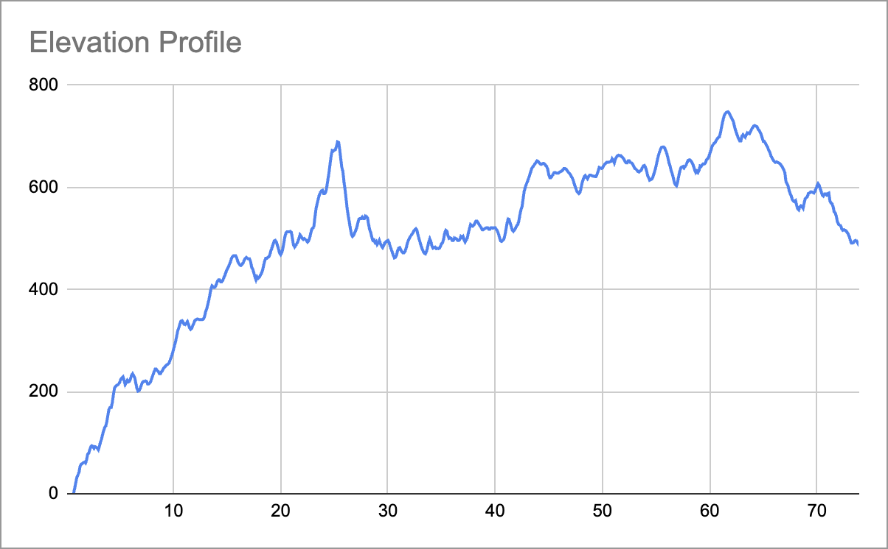

# GPX Pacer

A CLI tool to generate pacing spreadsheets from GPX and FIT files for ultra running.

_gpx-pacer_ produces data that athletes can use to create custom pacing plans. Useful for ultra running is the option to include surface data for each split. Splits can either be generated by distance or by waypoints, for example aid stations. Waypoints will be read from the GPX file. Below is an elevation profile of the Rennsteiglauf Supermarathon 2025 generated with _gpx-pacer_. (Settings: `gpx-pacer Rennsteiglauf2026.gpx -m distance -d 0.1`)

For convenience use the provided [gpx-pacer-template.xlsx](assets/gpx-pacer-template.xlsx) file to create your pacing plan.



## Features

- Split by fixed distance (1km, 5km, 1mi, etc.)
- Split by waypoints (aid stations from GPX)
- Post-race analysis mode from recorded activity GPX or FIT files
- Calculates elevation gain/loss and grade per segment
- Calculates net elevation change per split (Gain - Loss)
- Optional: Detects road surface type (Asphalt, Gravel, etc.) using OpenStreetMap data
- Multiple output formats: CSV (default) or JSON
- FIT analysis can also include running dynamics, power, respiration, workout metadata, and course points when present in the file

## Installation

Requires Python 3.12+ and [uv](https://docs.astral.sh/uv/).

```bash
git clone <repo-url>
cd gpx-pacer
uv sync
```

## Usage

### Fixed Distance Splits (default)

```bash
# 1km splits (default)
uv run gpx-pacer course.gpx

# FIT file
uv run gpx-pacer course.fit

# 5km splits
uv run gpx-pacer course.gpx -d 5

# 1 mile splits
uv run gpx-pacer course.gpx -u mi -d 1
```

### Waypoint Splits (Aid Stations)

If your GPX file contains `<wpt>` elements for aid stations, or your FIT file contains course points:

```bash
uv run gpx-pacer course.gpx -m waypoint
```

> **Note:** Waypoints more than 100m from the track will trigger a warning.

### Post-Race Analysis

Use a recorded activity GPX or FIT file to generate compact split summaries with actual elapsed time,
pace, and watch metrics such as heart rate, cadence, and temperature. FIT files can also add
power, respiration, running dynamics, and structured workout or course metadata when available.

```bash
# Analyze a recorded activity in 1km splits
uv run gpx-pacer data/Freiburg_Marathon_2026_Recording.gpx -m analysis

# Analyze a recorded activity FIT file
uv run gpx-pacer data/Freiburg_Marathon_2026_Recording.fit -m analysis

# Analyze a recorded activity in 100m splits
uv run gpx-pacer data/Freiburg_Marathon_2026_Recording.gpx -m analysis -d 0.1
```

### Surface Detection (Optional)

To automatically detect surface types for each split (requires internet connection):

```bash
uv run gpx-pacer course.gpx --surface
```

This downloads one route-level OpenStreetMap Overpass extract for the activity track, caches the raw JSON response, and matches split surfaces locally.

If the default Overpass endpoint is unavailable, override it with a custom endpoint, e.g. your own hosted instance:

```bash
uv run gpx-pacer course.gpx --surface --surface-endpoint https://server.url.com/api/interpreter
```

You can also set `GPX_PACER_SURFACE_ENDPOINT` and keep the CLI invocation unchanged.

> **Note:** This uses a free, public Overpass API instance which is rate-limited. `gpx-pacer` reduces load by making one buffered bbox request per activity track and caching the raw response for reuse.
> If the surface lookup endpoint returns an API or HTTP error, `gpx-pacer` exits with an error and suggests configuring `--surface-endpoint` or `GPX_PACER_SURFACE_ENDPOINT`.

### JSON Output

Export as structured JSON instead of CSV:

```bash
uv run gpx-pacer course.gpx -f json
```

The JSON output uses the structure `{ "metadata": {...}, "splits": [...] }`, making it easy to consume programmatically.

### Options

| Flag           | Short | Default              | Description                            |
| -------------- | ----- | -------------------- | -------------------------------------- |
| `--output`     | `-o`  | `<input>_pacing.csv` | Output file path                       |
| `--split-mode` | `-m`  | `distance`           | `distance`, `waypoint`, or `analysis`  |
| `--split-dist` | `-d`  | `1.0`                | Distance per split                     |
| `--unit`       | `-u`  | `km`                 | `km` or `mi`                           |
| `--format`     | `-f`  | `csv`                | Output format: `csv` or `json`         |
| `--surface`    |       | `False`              | Query split surfaces from one route-level OSM extract (requires internet) |
| `--surface-endpoint` |  | unset                | Override Overpass API endpoint for surface lookups |

## Output

### CSV (default)

The generated CSV contains:

**Route Data (calculated)**

- Segment Name
- Distance (cumulative)
- Split Length
- Gain / Loss (elevation in meters)
- Net Change (elevation in meters)
- Surface (optional)
- Grade %

**Planning Columns (empty for you to fill)**

- Target Pace
- Split Time
- Arrival Time
- Station Delay

Open in Excel or Google Sheets to complete your race plan.

The Excel template can derive per-split target pace from one global flat-course target pace. Enter your base target pace in the `Target Pace` input cell; the template adjusts each split using `Grade (%)` and a Minetti-style grade-cost polynomial. This gives uphill splits a slower target pace and downhill splits a grade-adjusted target pace. The adjustment is similar in concept to [Strava GAP](https://support.strava.com/hc/en-us/articles/216917067-Grade-Adjusted-Pace-GAP), but it is not an official Strava formula and does not account for surface, footing, fatigue, or technical terrain.

### JSON

The JSON output contains:

```json
{
  "metadata": {
    "filename": "course.gpx",
    "total_dist": 73932.71
  },
  "splits": [
    {
      "segment_name": "1.0 km",
      "distance_km": 1.0,
      "split_length_km": 1.0,
      "gain_m": 40,
      "loss_m": 8,
      "net_change_m": 32,
      "cumulative_elevation_m": 32,
      "grade_pct": 3.2
    }
  ]
}
```

The `surface` field is included in each split only when `--surface` is used.

### Analysis Output

When `-m analysis` is used, the output contains split summaries only. CSV and JSON include:

- Start and end distance
- Start and end time
- Elapsed time and pace
- Average and max heart rate
- Average cadence
- Average temperature
- FIT-only fields such as average speed, power, respiration, and running dynamics when present
- Elevation gain, loss, net change, and grade

For FIT analysis in JSON output, `metadata` may also include `fit_session`, `fit_laps`,
`fit_time_in_zone`, `fit_workout`, `fit_workout_steps`, and `fit_course_points`.

## Development

```bash
# Run tests
uv run pytest

# Type checking
uv run mypy src/
```

## License

MIT
